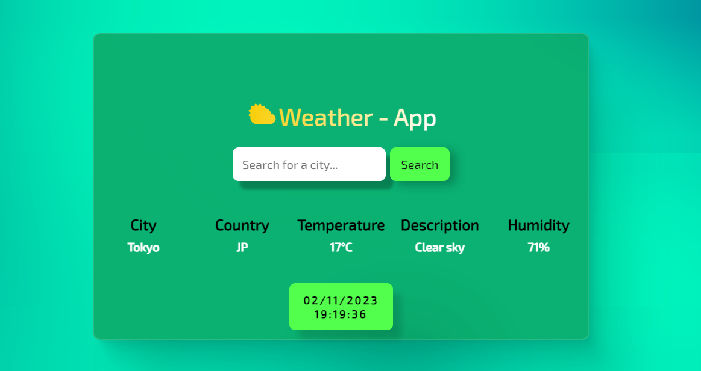

# 🌩 Weather-App
## Hi! In this application i build a simple Weather-App ⛅.

## ❄ What features does this application have ❔
* Weather information based on your "**location**" as soon as you enter the application. 🗺
* Weather information you can obtain depending on the "**city**" information you are looking for in the application. 🔎
* Current "**date**" and "**time**" information.

## 🌈 Here is the *live* version of app :
🟢<a href="https://weather-kadir.netlify.app/">Weather-App</a>
